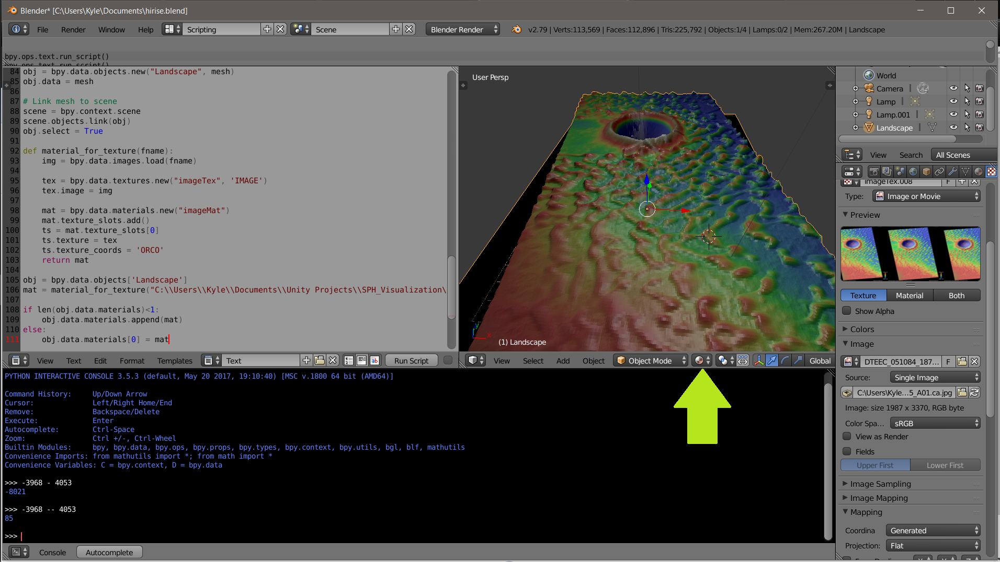

## HiRISE 3D Model Maker
Create 3D models (.obj, .glb, etc.) from terrain maps using a python script in Blender. Interact with the models through the web or mobile using [Google Poly](https://poly.google.com/user/2E_yxXvhmYl)


## Requirements
- Blender 
- Windows 3D Builder (or equivalent) 

## Modify Blender for 3rd party libraries

Delete the `numpy` folders in:
    
    C:\Program Files\Blender Foundation\Blender\2.79\python\lib\site-packages

Change Directory:  

    C:\Program Files\Blender Foundation\Blender\2.79\python\bin

Then run:

    python.exe -m ensurepip
    python.exe -m pip install scipy
    python.exe -m pip install scikit-image

* commands may vary depending on OS 

## Download a HiRISE Digital Terrain Map

- https://www.uahirise.org/dtm/

Download the CA (Color Altimetry) and AB (Annotated Browse) data like the links below

https://hirise-pds.lpl.arizona.edu/PDS/EXTRAS/DTM/ESP/ORB_019300_019399/ESP_019358_2225_ESP_018857_2225/DTEEC_019358_2225_018857_2225_U01.ab.jpg

https://hirise-pds.lpl.arizona.edu/PDS/EXTRAS/DTM/ESP/ORB_019300_019399/ESP_019358_2225_ESP_018857_2225/DTEEC_019358_2225_018857_2225_U01.ca.jpg

## Convert the DTM to a 3D model in Blender
Use this little script to remove text from the original images before creating a new mesh 
```python
    import numpy as np
    from scipy import ndimage

    cdata = ndimage.imread("DTEEC_019358_2225_018857_2225_U01.ca.jpg")
    data = ndimage.imread("DTEEC_019358_2225_018857_2225_U01.ca.jpg",mode="F")
    labels, features = ndimage.label(data>10)

    group_size = []
    for i in range(features):
        group_size.append( np.sum(labels[labels==i]) )
    mi = np.argmax(group_size)
    mask = labels==mi
    data[~mask] = 0
    cdata[~mask] = (0,0,0)

    data2 = ndimage.imread("DTEEC_019358_2225_018857_2225_U01.ab.jpg",mode="F")
    dmask = mask[:, abs(mask.shape[1]-data2.shape[1]): ]
    data2[~dmask] = 0

    cd = cdata[:, abs(mask.shape[1]-data2.shape[1]): ]
    alt = np.copy(data2)

```


## Creating a 3D model

1. Run the script [blender_terrain.py](blender_terrain.py) within blender after downloading the data. 

2. Export model to .glb

3. Open in Windows Builder 3D

4. Select the mesh, it will appear as a solid color

5. Paint> Texturize > Upload Image

6. Coverage 100% and add texture to mesh

7. Save as glb

If your Blender model appears as a solid color make sure you switch the Viewport Shading to material
